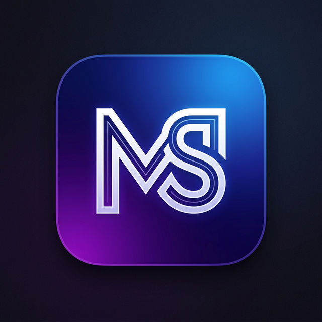

<p align="center">
  
</p>

<h1 align="center">Media Studio Toolkit</h1>

<p align="center">
  <strong>A free, open-source, offline desktop app for video, audio, and image processing — powered by FFmpeg.</strong>
</p>

<p align="center">
  <a href="#-features">Features</a> •
  <a href="#-installation">Installation</a> •
  <a href="#%EF%B8%8F-development">Development</a> •
  <a href="#-contributing">Contributing</a> •
  <a href="#-license">License</a>
</p>

---

## ✨ Features

**48 tools** across **7 categories** — all running locally on your machine, no uploads, no cloud, no internet required.

### 🎬 Video (20 tools)
Convert formats • Reduce file size • Change resolution • Social media optimizer • Change frame rate • Rotate • Flip • Trim • Cut out section • Split into clips • Merge videos • Change playback speed • Reverse • Crop • Zoom • Add text overlay • Add watermark • Brightness & contrast • Black & white • Sharpen • Blur region

### 🎵 Audio (8 tools)
Extract audio • Convert audio format • Remove audio • Replace audio • Normalize volume • Change bitrate • Change sample rate • Reduce background noise

### 💬 Subtitles (5 tools)
Add subtitles • Burn subtitles • Extract subtitles • Convert subtitle format • Fix subtitle timing

### 🖼️ Images & GIF (5 tools)
Create GIF • Extract frames • Create thumbnail • Video to image sequence • Slideshow from images

### 📡 Streaming & Web (3 tools)
Prepare for web streaming • Create HLS stream • Optimize for fast loading

### 🏷️ Metadata (3 tools)
View file info • Edit metadata • Strip all metadata

### ⚙️ Advanced (4 tools)
Batch process • Custom workflow • View FFmpeg command • Run custom command

---

## 🖥️ Tech Stack

| Layer | Technology |
|-------|-----------|
| **Framework** | Electron 34 |
| **Frontend** | React 18 + TypeScript |
| **Build Tool** | Vite 6 |
| **Styling** | Tailwind CSS 3 |
| **State** | Zustand 5 |
| **Animations** | Framer Motion 11 |
| **UI Components** | Radix UI + Lucide Icons |
| **Media Engine** | FFmpeg (bundled via ffmpeg-static) |

---

## 📦 Installation

### Download

Download the latest release from the [Releases](../../releases) page.

### Build from Source

> **Prerequisites:** [Node.js](https://nodejs.org/) 18+ and [Git](https://git-scm.com/)

```bash
# Clone the repository
git clone https://github.com/AliasgarJiwani/media-studio-toolkit.git
cd media-studio-toolkit

# Install dependencies
npm install

# Run in development mode
npm run dev

# Build for production
npm run build
```

---

## 🛠️ Development

### Project Structure

```
media-studio-toolkit/
├── electron/               # Electron main process
│   ├── main.ts             # Window management, IPC handlers
│   ├── preload.ts          # Context bridge (renderer ↔ main)
│   └── ffmpeg-runner.ts    # FFmpeg/FFprobe process management
├── src/                    # React renderer
│   ├── components/         # UI components
│   │   ├── DropZone.tsx    # Drag-and-drop file input
│   │   ├── Sidebar.tsx     # Tool category navigation
│   │   ├── ToolPanel.tsx   # Tool options & execution
│   │   ├── ProgressBar.tsx # Real-time progress tracking
│   │   ├── JobHistory.tsx  # Past job history
│   │   ├── Settings.tsx    # App settings
│   │   └── ...
│   ├── tools/              # Tool definitions (one file per category)
│   │   ├── video/index.ts
│   │   ├── audio/index.ts
│   │   ├── images/index.ts
│   │   ├── subtitles/index.ts
│   │   ├── streaming/index.ts
│   │   ├── metadata/index.ts
│   │   ├── advanced/index.ts
│   │   └── registry.ts    # Tool registry & category config
│   ├── store/              # Zustand state management
│   ├── types/              # TypeScript type definitions
│   ├── lib/                # Utility functions
│   └── App.tsx             # Root component
├── public/                 # Static assets
└── package.json
```

### Scripts

| Command | Description |
|---------|-------------|
| `npm run dev` | Start Vite dev server (renderer only) |
| `npm run electron:dev` | Start full Electron + Vite development |
| `npm run build` | Type-check, build renderer, and package Electron app |
| `npm run lint` | Run ESLint on source files |

### Adding a New Tool

1. Open the appropriate category file in `src/tools/` (e.g., `video/index.ts`).
2. Add a new tool object to the exported array:

```typescript
{
  id: 'my-new-tool',              // Unique identifier
  category: 'video',             // Must match the file's category
  name: 'My New Tool',           // Display name
  description: 'What this tool does.',
  icon: SomeIcon,                // Lucide icon component
  acceptedInputTypes: ['video'], // 'video' | 'audio' | 'image' | 'subtitle' | 'any'
  requiresInput: true,
  options: [
    {
      id: 'quality',
      label: 'Quality',
      description: 'Tooltip text',
      type: 'select',            // 'select' | 'slider' | 'number' | 'text' | 'toggle' | 'color' | 'file-picker' | 'file-list' | 'textarea'
      defaultValue: 'high',
      options: [
        { value: 'high', label: 'High' },
        { value: 'low', label: 'Low' },
      ],
    },
  ],
  buildCommand: (inputPath, outputPath, options) => [
    '-i', inputPath,
    '-c:v', 'libx264',
    '-pix_fmt', 'yuv420p',      // Always include for video re-encoding
    '-y', outputPath,
  ],
  outputExtension: 'mp4',       // or a function: (opts) => opts.format
}
```

3. The tool automatically appears in the sidebar — no registration needed.

### FFmpeg Command Guidelines

When writing `buildCommand` functions, follow these rules to avoid runtime errors:

- **Always add `-pix_fmt yuv420p`** when your tool re-encodes video (uses filters like `-vf` or `-filter_complex`). This ensures H.264 compatibility with all input pixel formats.
- **Ensure even dimensions** for any `crop` or `scale` values — H.264 requires width and height to be divisible by 2. Use `Math.floor(value / 2) * 2`.
- **Don't escape commas** in filter expressions. Since FFmpeg is spawned with `child_process.spawn()` (args are passed as an array), shell escaping is not needed.
- **Use `split` for `filter_complex`** when you need to read the same stream twice (e.g., blur region). Never reference `[0:v]` multiple times without splitting.
- **Use `-y`** to overwrite output files without prompting.
- **Use `-c:a copy`** when you only modify video, to avoid unnecessary audio re-encoding.

---

## 🤝 Contributing

We welcome contributions! Please see [CONTRIBUTING.md](CONTRIBUTING.md) for guidelines.

---

## 📄 License

This project is open source. See the [LICENSE](LICENSE) file for details.

---

<p align="center">
  Developed with ❤️ by <a href="https://www.grillstech.in/">Grills Tech</a>
</p>
